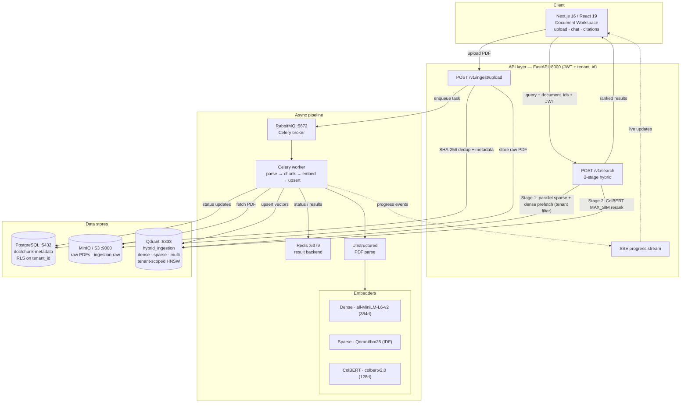

# Sports Science Semantic Search Engine

This repository contains **two complementary retrieval systems** over a corpus
of sports-science research papers:

| Pipeline | Path | What it is |
|----------|------|-----------|
| **Core engine** | `sports_science_search/` + `examples/` | A standalone, single-process semantic search engine over the 27 PDFs in `assets/`. Compares three chunking strategies on a single Qdrant collection. The original project. |
| **Hybrid ingestion backend** | `backend/` + `frontend/` | A production-grade, multi-tenant ingestion + hybrid-retrieval service (FastAPI · Celery · Postgres · Qdrant · MinIO) with a NotebookLM-style Next.js workspace. |

The **core engine** extracts text and metadata from each PDF, chunks it using
**three strategies**, embeds the chunks with Sentence Transformers, stores them
in **Qdrant** (one named vector per strategy), and lets you search and compare
the strategies side by side.

## System architecture



> The standalone **core engine** is independent of the backend stack — see its
> dedicated flow under [Core engine](#core-engine-sports_science_search) below.
> A detailed component/port/env reference lives in
> [`docs/CODEMAPS/infrastructure.md`](docs/CODEMAPS/infrastructure.md).

## Core engine (`sports_science_search/`)

The standalone engine lives in the `sports_science_search/` package — one
responsibility per module:

| Module | Responsibility |
|--------|----------------|
| `constants.py` | Section patterns, chunking params, Qdrant/embedding config |
| `exceptions.py` | `PDFExtractionError`, `SectionDetectionError`, `VectorUploadError`, `PDFProcessingError` |
| `models.py` | Immutable dataclasses: `Paper`, `PaperChunk`, `SearchResult` |
| `pdf_extractor.py` | `PDFExtractor` — PyMuPDF text extraction, section detection, metadata |
| `text_chunker.py` | `TextChunker` — semantic / paragraph / fixed-size chunking |
| `vector_store.py` | `VectorStore` — Qdrant collection, upload, search, stats |
| `search_engine.py` | `SemanticSearchEngine` — orchestrates the full pipeline |

```
PDF -> PDFExtractor -> Paper
Paper -> TextChunker -> [PaperChunk] (semantic + paragraph + fixed)
[PaperChunk] -> VectorStore.upload_chunks -> Qdrant (named vectors)
query -> VectorStore.search(strategy) -> [SearchResult]
```

### Chunking strategies

| Strategy | How it splits | Named vector |
|----------|---------------|--------------|
| `semantic` | llama-index `SemanticSplitterNodeParser` (buffer=1, threshold=95) | `semantic` |
| `paragraph` | double-newline paragraphs (falls back to single newline) | `paragraph` |
| `fixed` | 200-word windows with 50-word overlap | `fixed` |

All three use `all-MiniLM-L6-v2` (384-dim, cosine distance).

## Setup

```bash
source .venv/bin/activate          # project virtualenv
# dependencies are already installed; for a fresh env use:
#   uv pip install pymupdf sentence-transformers llama-index \
#       llama-index-embeddings-huggingface qdrant-client python-dotenv
```

Create a `.env` with your Qdrant Cloud credentials (already present in this repo):

```
QDRANT_URL=https://<your-cluster>.cloud.qdrant.io
QDRANT_API_KEY=<your-key>
```

## Usage (CLI)

The runnable entry point is `examples/run_search_demo.py`.

```bash
# 1. One-time ingest of all 27 PDFs into Qdrant Cloud (recreate from scratch)
PYTHONPATH=. python examples/run_search_demo.py ingest --recreate

# 2. Query — searches all three strategies and prints a comparison
PYTHONPATH=. python examples/run_search_demo.py search "high intensity interval training"
PYTHONPATH=. python examples/run_search_demo.py search "GPS tracking accuracy" --limit 5 --section Methods

# 3. Inspect the collection
PYTHONPATH=. python examples/run_search_demo.py stats
PYTHONPATH=. python examples/run_search_demo.py analyze

# Export a search result to JSON
PYTHONPATH=. python examples/run_search_demo.py search "muscle fatigue" --export out.json
```

### Local, no-cloud run

For a fully self-contained run on an in-memory Qdrant (ingest + one search in a
single process — nothing is persisted):

```bash
PYTHONPATH=. python examples/run_search_demo.py demo --query "muscle fatigue"
```

## Usage (library)

```python
from pathlib import Path
from qdrant_client import QdrantClient
from sports_science_search import SemanticSearchEngine

engine = SemanticSearchEngine(
    pdf_dir=Path("assets"),
    qdrant_client=QdrantClient(":memory:"),   # or QdrantClient(url=..., api_key=...)
)
engine.process_papers(recreate_collection=True)

results = engine.search_and_compare("acceleration load monitoring", limit=3)
print(results["analysis"]["top_strategy"])
```

## Notes

- The first run downloads the `all-MiniLM-L6-v2` model (~200 MB) and caches it
  in `~/.cache/huggingface`.
- Section detection auto-detects via regex; papers that fail auto-detection can
  be supplied a manual mapping JSON (`manual_mappings_path`).
- The legacy single-file module `12_handson_sportscience_semantic_engine.py` is
  now a backwards-compatibility shim that re-exports the package.

## Known limitations / technical debt

- `VectorStore.upload_chunks` encodes chunks one at a time and uses sequential
  integer point IDs — batch encoding and UUID IDs are pending optimizations.
- `avg_chunk_size` in the analysis output is an approximation.

## Multi-Tenant Hybrid Ingestion Backend (`backend/`)

The `backend/` directory is a production-grade, multi-tenant document ingestion
and **hybrid retrieval** service, orchestrated entirely with Docker Compose. It
is independent of the core engine above and is what the frontend talks to.

### Stack

| Service | Port | Purpose |
|---------|------|---------|
| **FastAPI** | 8000 | Upload + search REST API, JWT auth carrying `tenant_id` |
| **PostgreSQL** | 5432 | Document/chunk metadata with Row-Level Security on `tenant_id` |
| **RabbitMQ** | 5672 / 15672 | Celery broker |
| **Redis** | 6379 | Celery result backend |
| **Celery worker** | — | Parse → chunk → embed → Qdrant upsert |
| **MinIO** (S3-compatible) | 9000 / 9001 | Raw PDF storage (`ingestion-raw` bucket) |
| **Qdrant** | 6333 / 6334 | Shared hybrid collection `hybrid_ingestion` |

### Hybrid retrieval

Each chunk is embedded three ways and stored as named vectors in one shared,
tenant-partitioned Qdrant collection:

| Vector | Model | Role |
|--------|-------|------|
| `dense` | `sentence-transformers/all-MiniLM-L6-v2` (384d, cosine) | Semantic recall |
| `sparse` | FastEmbed `Qdrant/bm25` (server-side IDF) | Lexical recall |
| `multi` | `colbert-ir/colbertv2.0` (128d, MAX_SIM, HNSW `m=0`) | Late-interaction rerank |

Search is two-stage: **(1)** parallel sparse + dense prefetch (top-20 each,
tenant-filtered), then **(2)** ColBERT `MAX_SIM` rerank over the unified
candidates (top-10). Global HNSW is disabled (`m=0`) in favour of
payload-scoped graphs (`payload_m=16`) keyed on a `tenant_id` keyword index
(`is_tenant=true`). Qdrant point IDs are `sha256(f"{document_id}:{chunk_index}")`,
so Celery retries overwrite rather than duplicate.

### Quick start

```bash
cd backend
cp .env.example .env
docker compose up --build
# API http://localhost:8000 · Qdrant :6333 · MinIO console :9001 · RabbitMQ :15672
docker compose exec api python scripts/generate_dev_token.py   # dev JWT
```

See [`backend/README.md`](backend/README.md) for the full API contract,
parsing options, and Celery reliability settings.

## Document Workspace Frontend

The `frontend/` directory contains a NotebookLM-style document workspace UI built with **Next.js 16 (App Router)** and **React 19**. This provides an interactive interface for uploading PDFs, viewing source documents with citations, and conducting multi-document chat sessions.

### Features

- **Drag-and-drop PDF ingestion** — PDF-only uploads (max 50MB), local UUID tracking, status progression (PENDING → UPLOADING → PROCESSING → COMPLETED/FAILED)
- **Real-time parsing updates** — Server-Sent Events stream granular sub-states (e.g. "Extracting tables", "Generating embeddings")
- **Split-pane workspace layout** — Three-column interface:
  - **Left**: Source manager grid showing document cards with checkboxes for selecting chat context
  - **Center**: Citation viewer with interactive PDF rendering and SVG bounding box overlays
  - **Right**: Multi-document chat panel with citation chips that scroll and highlight source passages
- **Interactive citations** — Click chat citations to scroll PDF, highlight relevant bounding boxes, and navigate source documents
- **Multi-tenant security** — Axios interceptor automatically attaches `Authorization: Bearer <JWT>` on all requests; search queries filter by selected `document_ids`

### Quick start

See [`frontend/README.md`](frontend/README.md) for detailed setup instructions and architecture overview.

```bash
cd frontend
npm install
npm run dev
# Open http://localhost:3000/workspace/default
```

The frontend includes mock API routes at `/api/v1` for local development without a running Python backend. To integrate with the Python RAG backend, set `NEXT_PUBLIC_API_URL=http://localhost:8000/api/v1` in `.env.local`.

### Backend integration

The frontend communicates with a Python backend via REST API. All requests require JWT authentication with a `tenant_id` in the token payload. For the mock API contract and detailed endpoint specifications, see [`docs/CODEMAPS/frontend.md`](docs/CODEMAPS/frontend.md#backend-contract).
