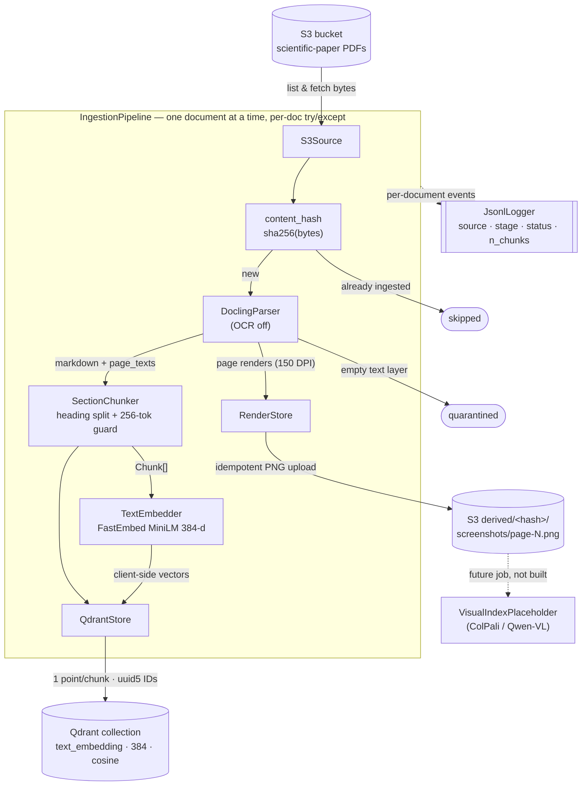

# SportsScience RAG — S3 → Docling → Qdrant ingestion

Document-level, chunk-based ingestion of scientific-paper PDFs from AWS S3 into
a Qdrant vector collection, with per-page renders persisted back to S3. Built as
a modular, class-oriented package under `src/sportsscience_rag/`.

## Pipeline stages

`S3Source` (list/fetch `.pdf` objects) → `DoclingParser` (layout-aware markdown +
150-DPI per-page renders, OCR off, empty-text triage, per-page text for page
mapping) → `RenderStore` (idempotent page-PNG upload to
`s3://<bucket>/derived/<content_hash>/screenshots/page-<N>.png`) → `SectionChunker`
(heading-aware split on `#/##/###` → 256-token size guard using the MiniLM
tokenizer, tables kept intact, absolute `section_path` provenance, best-effort
`page_numbers`) → `TextEmbedder` (local FastEmbed `all-MiniLM-L6-v2`, 384-dim,
client-side vectors) → `QdrantStore` (one point per chunk, `uuid5(content_hash:chunk_index)`
IDs, skip-if-present).

`IngestionPipeline` iterates **documents** one at a time with per-document
try/except: any failure (corrupt PDF, empty text layer, parse/embed/upsert error)
is recorded as a structured quarantine entry and the batch continues. Idempotency
comes from content-hash-derived point IDs plus a skip check on
`(content_hash, parser_version, chunk_config_hash)`, so re-running is a no-op for
already-ingested files. Visual (ColPali/Qwen-VL) indexing is **seeded** — page
renders live in S3 — but not built; see `visual_index.py` for the extension point.

## Workflow



Any per-document failure (corrupt PDF, empty text, parse/embed/upsert error) is
recorded as a `QuarantineEntry` and the batch continues. Re-running is a no-op
for documents already ingested under the same `(content_hash, parser_version,
chunk_config_hash)`.

## Setup

```bash
source .venv/bin/activate
uv pip install -e ".[dev]"       # deps incl. docling, fastembed, qdrant-client
cp .env.example .env             # fill in AWS + Qdrant Cloud values
```

### Environment variables

Generated from `.env.example`:

| Variable | Required | Description |
|----------|----------|-------------|
| `AWS_ACCESS_KEY_ID` | Yes | AWS credentials for S3 access |
| `AWS_SECRET_ACCESS_KEY` | Yes | AWS credentials for S3 access |
| `AWS_REGION` | Yes | S3 bucket region (e.g. `eu-west-1`) |
| `S3_BUCKET` | Yes | Source PDFs **and** destination for derived page renders |
| `QDRANT_URL` | Yes | Qdrant Cloud cluster endpoint |
| `QDRANT_API_KEY` | Yes | Qdrant Cloud API key |
| `QDRANT_COLLECTION` | No | Default collection name (default `sport-science-documents`; overridable with `--collection`) |

## Run

```bash
# List PDFs only — no writes
python -m sportsscience_rag --dry-run --limit 5

# Ingest the first 2 PDFs under a prefix into a named collection
python -m sportsscience_rag --prefix papers/ --limit 2 \
    --collection my-test --quarantine-report quarantine.json

# Full batch (all prefixes / bucket root)
python -m sportsscience_rag --prefix papers/
```

CLI flags: `--prefix` (repeatable), `--collection`, `--limit N`,
`--quarantine-report PATH`, `--derived-prefix` (default `derived/`), `--dry-run`,
`-v/--verbose`.

### Operational notes

- **Docling is CPU/GPU-bound** (~15–40s per PDF on Apple MPS). The full ~1000-paper
  corpus is a multi-hour, one-shot batch — run it detached (`nohup`/`tmux`).
- Run **one convert at a time** (the pipeline already does). Concurrent Docling
  converts can deadlock on Hugging Face model locks.
- Once Docling/FastEmbed models are cached, set `HF_HUB_OFFLINE=1` to skip HF
  network round-trips (faster, avoids rate-limit stalls).

## Test

```bash
pytest -m "not integration"      # fast unit tests (mocked S3/Qdrant, fake tokenizer)
HF_HUB_OFFLINE=1 pytest -m integration   # loads the embedding model + parses a real PDF
pytest --cov=sportsscience_rag --cov-report=term-missing
```

## Classes

One responsibility per module; frozen dataclasses, type hints, Google-style
docstrings throughout.

| Module | Public API | Responsibility |
|--------|-----------|----------------|
| `config.py` | `IngestionConfig` (frozen) · `.from_env()` · `.chunk_config_hash` | Env-driven, validated configuration; derives the chunk-config hash |
| `models.py` | `RawPdf` · `PageRender` · `Chunk` · `ParsedDocument` · `QuarantineEntry` · `IngestOutcome` | Immutable data structures passed between stages |
| `hashing.py` | `content_hash()` · `chunk_config_hash()` | SHA-256 content hash + short chunk-config hash |
| `s3_source.py` | `S3Source` · `parse_s3_url()` | List and fetch `.pdf` objects under S3 prefixes |
| `parser.py` | `DoclingParser` · `PARSER_VERSION` | PDF bytes → markdown + 150-DPI page renders + per-page text (OCR off, empty-text triage) |
| `chunker.py` | `SectionChunker` | Heading-aware split (`#/##/###`) → 256-token MiniLM-tokenizer guard; tables intact; absolute `section_path`; best-effort `page_numbers` |
| `embedder.py` | `TextEmbedder` | Local FastEmbed `all-MiniLM-L6-v2`, 384-d client-side vectors |
| `persistence.py` | `RenderStore` | Idempotent S3 upload of page PNGs to the derived prefix |
| `qdrant_store.py` | `QdrantStore` · `point_id()` · `NAMESPACE` · `VECTOR_NAME` | Collection + keyword payload indexes; `uuid5` IDs; skip-if-present; upsert |
| `logging_setup.py` | `JsonlLogger` | Structured per-document JSONL events |
| `pipeline.py` | `IngestionPipeline` · `IngestionResult` | Orchestration, per-document quarantine, resumability |
| `visual_index.py` | `VisualIndexPlaceholder` | Dormant ColPali/Qwen-VL extension point (raises `NotImplementedError`) |
| `cli.py` | `build_arg_parser()` · `main()` | argparse surface + pipeline wiring |

## Repository structure

```
SportsScienceRAG/
├── src/sportsscience_rag/       # the ingestion package (editable install)
│   ├── __init__.py              # PACKAGE_VERSION
│   ├── __main__.py              # python -m sportsscience_rag → cli.main()
│   ├── config.py                # IngestionConfig
│   ├── models.py                # frozen dataclasses
│   ├── hashing.py               # content_hash / chunk_config_hash
│   ├── s3_source.py             # S3Source
│   ├── parser.py                # DoclingParser
│   ├── chunker.py               # SectionChunker
│   ├── embedder.py              # TextEmbedder
│   ├── persistence.py           # RenderStore
│   ├── qdrant_store.py          # QdrantStore
│   ├── logging_setup.py         # JsonlLogger
│   ├── pipeline.py              # IngestionPipeline
│   ├── visual_index.py          # ColPali/Qwen-VL seed (not built)
│   └── cli.py                   # CLI + wiring
├── tests/                       # pytest suite (unit + `integration`-marked)
├── tools/bulk_download_papers.py# paper-acquisition helper (separate concern)
├── assets/                      # sample PDFs for local/integration testing
├── examples/                    # Qdrant reference notebooks
├── docs/superpowers/            # design spec + implementation plan
├── pyproject.toml               # deps + editable install + pytest config
├── .env.example                 # environment variable template
└── README.md
```

## Dependencies

Generated from `pyproject.toml`:

| Package | Purpose |
|---------|---------|
| `docling` | Local, layout-aware PDF parsing + page rendering |
| `fastembed` | Local MiniLM dense embeddings (384-d) |
| `qdrant-client` | Vector collection management + upsert |
| `boto3` | S3 listing, fetching, render upload |
| `langchain-text-splitters` | Markdown-header + recursive chunk splitting |
| `Pillow` | Page-render image encoding (PNG) |
| `python-dotenv` | `.env` loading |
| `pytest`, `pytest-cov` *(dev)* | Test suite + coverage |
